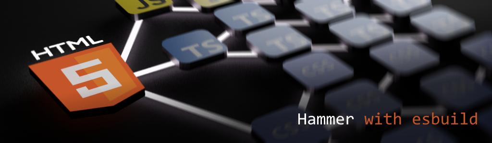

<div align='center'>

<h1>Hammer</h1>

<p>Build Tool for Browser and Node Applications</p>

[](https://badge.fury.io/js/%40sinclair%2Fhammer)



</div>

## Install

```shell
$ npm install @sinclair/hammer -g
```

## Usage

Create an `index.html` file
```html
<!DOCTYPE html>
<html>
  <head>
    <link href="index.css" rel="stylesheet" />
    <script src="index.tsx"></script>
  </head>
  <body>
    
  </body>
</html>
```
Run Hammer
```shell
$ hammer build index.html
```
Done

## Overview

Hammer is a command line tool for browser and node application development. It provides a command line interface to trivially run both browser and node applications and offers appropriate `watch` and `reload` workflows for each environment. It is designed with rapid application development in mind and requires little to no configuration to use.

Hammer was written to consolidate several disparate tools related to monitoring node processes (nodemon), building from HTML (parcel), mono repository support (lerna, nx) and project automation (gulp, grunt). It takes `esbuild` as its only dependency and is as much concerned with build performance as it is with dramatically reducing the number of development dependencies required for modern web application development.

License MIT

## Serve

Use the `serve` command to start a development server that reloads pages on save.

```html
<!DOCTYPE html>
<html>
  <head>
    <script type="module" src="index.tsx"></script>
  </head>
  <body>
    <h1>Hello World</h1>
  </body>
</html>
```
```bash
$ hammer serve index.html
```

## Run

Use the `run` command to start a node process that restarts on save.

```bash
$ hammer run index.ts

$ hammer run "index.ts arg1 arg2" # use quotes to pass arguments
```

## Watch

Use the `watch` command to start a compiler watch process only.

```bash
$ hammer watch worker.ts
```

## Monitor

Use the `monitor` command to execute shell commands on file change.

```bash
$ hammer monitor index.ts "deno run --allow-all index.ts"
```

## Tasks

Hammer provides a built-in task runner for automating various workflow at the command line. Tasks are created with JavaScript functions specified in a file named `hammer.mjs`. Hammer will search for the `hammer.mjs` file in the current working directory and setup a callable command line interface to each exported function. Hammer provides a global `shell(...)` function that can be used to start command line processes within each task. Additional functionality can be imported via ESM `import`. The following shows running a Hammer website and server watch process in parallel.

```typescript
//
// file: hammer.mjs
//
export async function start() {
    await Promise.all([
        shell(`hammer serve apps/website/index.html --dist dist/website`),
        shell(`hammer run apps/server/index.ts --dist dist/server`)
    ])
}
```
```bash
$ hammer task start
```

## Libs

In mono repository projects, you can import shared libraries by using TypeScript `tsconfig.json` path aliasing.

```shell
/apps
  /server
    index.ts    ───────────┐
  /website                 │
    index.html             │
    index.ts    ───────────┤ depends on
/libs                      │
  /shared                  │
    index.ts    <──────────┘
tsconfig.json
```
To enable `website` and `server` to import the `shared` library. Configure `tsconfig.json` in the project root as follows.

```javascript
{
    "compilerOptions": {
        "baseUrl": ".",
        "paths": {
            "@libs/shared": ["libs/shared/index.ts"],
        }
    }
}
```

Once configured the `server` and `website` applications can import with the following.

```typescript
import { Foo } from '@libs/shared'
```

## Cli

Hammer provides the following command line interface.

```
Commands:
   $ hammer run     <entry script>   <...options>
   $ hammer build   <file or folder> <...options>
   $ hammer watch   <file or folder> <...options>
   $ hammer serve   <file or folder> <...options>
   $ hammer monitor <file or folder> <shell command>
   $ hammer task    <task>           <...arguments>
   $ hammer version
   $ hammer help

Options:

   --target      targets     The es build targets.
   --platform    platform    The target platform.
   --dist        directory   The target directory.
   --port        port        The port to listen on.
   --minify                  Minifies the output.
   --sourcemap               Generate sourcemaps.
   --external                External packages.
```
