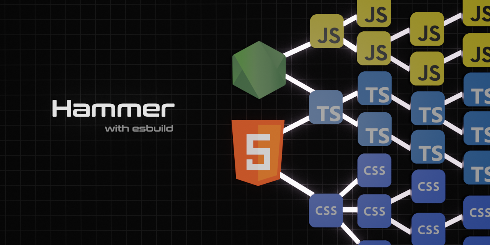

<div align='center'>

<h1>Hammer</h1>

<p>Build Tool for Single Page HTML Applications</p>

[](https://badge.fury.io/js/%40sinclair%2Ftypebox)



</div>

## Install

```shell
$ npm install -g @sinclair/hammer 
```

## Usage

Create an `index.html` file with some `<script>` and `<link>` tags.

```html
<!DOCTYPE html>
<html>
  <head>
    <link href="index.css" rel="stylesheet" />
    <script src="index.tsx"></script>
  </head>
  <body>hello world</body>
</html>
```
Run Hammer
```shell
$ hammer index.html --outDir dist
```
Done
## Overview

Hammer is a tool for automatically bundling `<script>` and `<link>` tags found within HTML files. It operates similar to bundlers like Parcel where required script and css assets can be derived directly from HTML. Hammer uses `esbuild` to provide enhanced build performance as well as to significantly reduce development dependencies. Hammer also provides a development server for basic automatic save and refresh workflows.

Hammer was created to be an ultra lightweight alternative to bundlers like Parcel. It trades flexiblity in configuration with automatic bundling functionality that is quick and easy to use.

License MIT

## Cli

The following command line parameters are supported.

```
Examples: hammer index.html
          hammer index.html --outDir target/app
          hammer index.html --outDir target/app --watch 5000
          hammer index.html --outDir target/app --watch 5000 --target safari11

Options:
  --outDir    The output directory (default: dist)
  --target    Sets the ES target (default: esnext)
  --minify    Minifies the bundle (default: false)
  --sourcemap Generate sourcemaps (default: false)
  --watch     Starts the compiler in watch mode (default: false)
  --port      Sets the watch server port (default: 5000)
```

## Api

Hammer provides the following API which analogs the Cli interface. All parameters are required.

```typescript
import { start } from '@sinclair/hammer'

await start({
  htmlPath: 'index.html', 
  outDir: './dist', 
  target: 'esnext',
  minify: false,
  sourcemap: false,
  watch: false,
  port: 5000
})
```